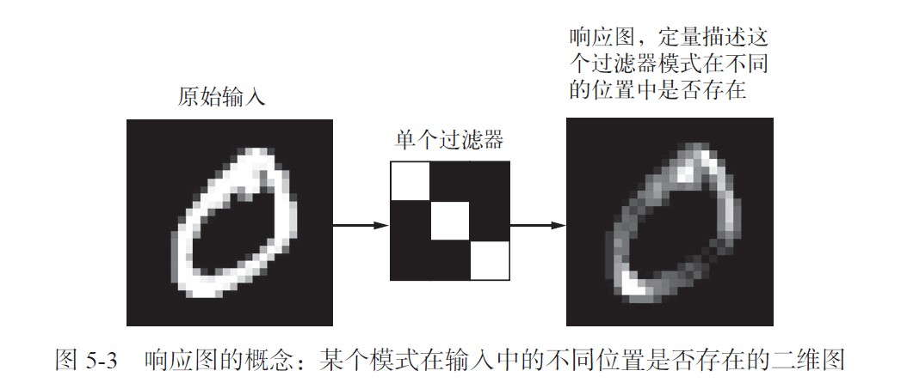
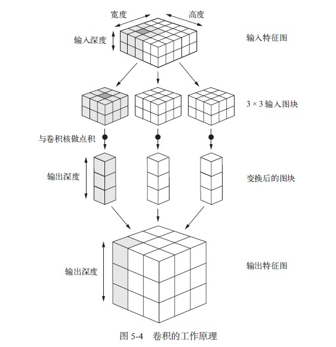
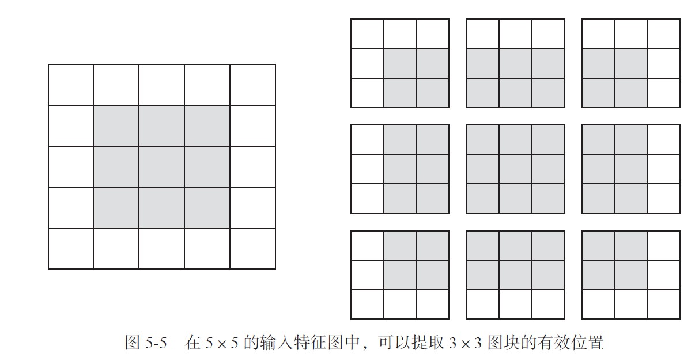
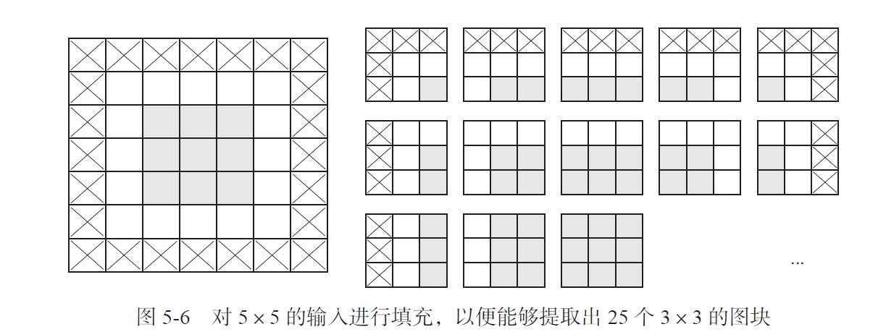
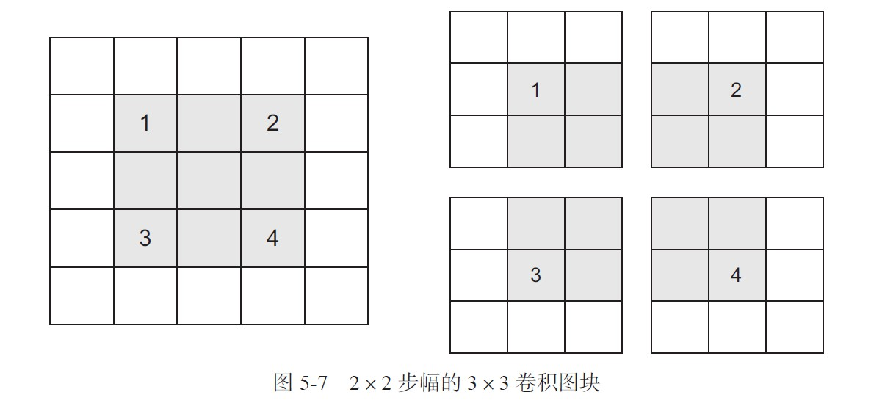

## 第五章 深度学习用于计算机视觉

### 5.0 概览

主要内容：

1. 理解卷积神经网络（convnet）  
2. 使用数据增强来降低过拟合  
3. 使用预训练的卷积神经网络进行特征提取  
4. 微调预训练的卷积神经网络  
5. 将卷积神经网络学到的内容及其如何做出分类决策可视化  

### 5.1 卷积神经网络简介

先实例化一个简单的卷积神经网络模型,并做出简单的说明  

```python
from keras import layers
from keras import models
model = models.Sequential()
model.add(layers.Conv2D(32, (3, 3), activation='relu', input_shape=(28, 28, 1)))
model.add(layers.MaxPooling2D((2, 2)))
model.add(layers.Conv2D(64, (3, 3), activation='relu'))
model.add(layers.MaxPooling2D((2, 2)))
model.add(layers.Conv2D(64, (3, 3), activation='relu'))
```

可以看到卷积神经网络是conv2D层和MaxPooling2D层的交替堆叠。  

卷积神经网络的接受形状是(image_height,image_width,image_channels),这是一个3D张量，从第二章可以知道图像一般存储与4D张量中，但是不管是深度神经网络还是卷积神经网络，我们接受的形状都只需要特征shape，那么自然这里也不包括样本维度（或批量维度）。**对于整个卷积神经网络的接受形状只需要在第一层传入input_shape=(image_height,image_width,image_channels)**即可，本例中即(28,28,1)。

列出卷积神经网络的架构

```python
>>> model.summary()
_________________________________________________________________
Layer (type) Output Shape 								Param #
=================================================================
conv2d_1 (Conv2D) (None, 26, 26, 32) 					320
_________________________________________________________________
max_pooling2d_1 (MaxPooling2D) (None, 13, 13, 32) 		0
_________________________________________________________________
conv2d_2 (Conv2D) (None, 11, 11, 64) 					18496
_________________________________________________________________
max_pooling2d_2 (MaxPooling2D) (None, 5, 5, 64) 		0
_________________________________________________________________
conv2d_3 (Conv2D) (None, 3, 3, 64) 						36928
=================================================================
Total params: 55,744
Trainable params: 55,744
Non-trainable params: 0
```

> 回忆一下神经网络，第一层输入的input_shape为(28,28).reshape(-1,1),即将所有特征列展平，然后作为这一层权重矩阵的行数，而列数就是这一层输出的神经元个数(new_features)，那么这一层输出矩阵就是  （samples,new_features),因为我们可以很清晰的知道矩阵运算，输入矩阵的一行（就是一个样本）乘以该层的权重矩阵的一列，所以得出权重矩阵的行数就应该是输入矩阵的列数（即输入了多少个特征）。  
>
> 但是在卷积神经网络里，我们无法想象每一层做的运算是怎么样的，也就很难计算该层该有多少个参数，以及输入、输出（不再是矩阵）代表着什么，又是多少？带着这个疑问继续向后看。

虽然暂时还无法理解，但是可以知道，我们可以设置输入的形状（上面提到），每一层的输出也可以设置

> 对于Conv2D层和MaxPooling2D层而言，**输出为(height,width,channels)**的一个3D张量。但是请注意，设定这些参数时**顺序不一样，他将通道数量放在第一个，而宽高作为元组放在第二个上，即(channels,(height,width)**,并且通道数量一般设置为32或64。这三个维度的意义待会再讲。

现在需要将输出张量输入到神经网络里(密集连接分类网络，就是第二章那个)，因为是接上面model添加的层，所以直接使用Flatten()就会将输入的特征张量展平为一层（不包括样本维度）  

```python
model.add(layers.Flatten())
model.add(layers.Dense(64, activation='relu'))
model.add(layers.Dense(10, activation='softmax'))
```

查看网络架构

```python
>>> model.summary()
_________________________________________________________________  
Layer (type) Output Shape 								Param #  
=================================================================   
conv2d_1 (Conv2D) (None, 26, 26, 32) 					320  
_________________________________________________________________
max_pooling2d_1 (MaxPooling2D) (None, 13, 13, 32) 		0  
_________________________________________________________________  
conv2d_2 (Conv2D) (None, 11, 11, 64) 					18496  
_________________________________________________________________  
max_pooling2d_2 (MaxPooling2D) (None, 5, 5, 64) 		0  
_________________________________________________________________  
conv2d_3 (Conv2D) (None, 3, 3, 64) 						36928  
_________________________________________________________________  
flatten_1 (Flatten) (None, 576) 						0  
_________________________________________________________________  
dense_1 (Dense) (None, 64) 								36928   
_________________________________________________________________  
dense_2 (Dense) (None, 10) 								650  
=================================================================  
Total params: 93,322
Trainable params: 93,322
Non-trainable params: 0
```

下面训练并测试，可以得出准确率非常高，为99.3%

```python
from keras.datasets import mnist
from keras.utils import to_categorical
(train_images, train_labels), (test_images, test_labels) = mnist.load_data()
train_images = train_images.reshape((60000, 28, 28, 1))
train_images = train_images.astype('float32') / 255
test_images = test_images.reshape((10000, 28, 28, 1))
test_images = test_images.astype('float32') / 255
train_labels = to_categorical(train_labels)
test_labels = to_categorical(test_labels)
model.compile(optimizer='rmsprop',
loss='categorical_crossentropy',
metrics=['accuracy'])
model.fit(train_images, train_labels, epochs=5, batch_size=64)
我们在测试数据上对模型进行评估。
>>> test_loss, test_acc = model.evaluate(test_images, test_labels)
>>> test_acc
0.99080000000000001
```

#### 5.1.1 卷积运算

卷积层和密集连接层的最大区别就是卷积层是局部模式学习，而密集连接层学习的是全局模型，全局模式就是输入的特征全部进行“观察”进行学习，我们之前就是每一层将输入都一次性纳入计算并输出给下一层；而局部模型是设定更小的窗口（比如我只学3*3这么大窗口的特征，每一层可以学很多个这样的小窗口），通过更加细致的学习然后再组成整个特征集，这样肯定学得更好。


基于此特点卷积神经网络具有一下两个重要性质：  

> - 卷积神经网络学到的模式具有平移不变性（translation invariant):在图像的某个部分学到的局部模式（也就是长什么样子），它可以在其他地方也找到这种模式。而密集连接网络是学得全局模式，比方说前者在某一图像上学到一个数字9，那么在很多其他图，都可以识别到9（有的话），而后者学的是一整张图，其他图也是这个模式（整张图）的概率显然小的多，这就是视觉世界的平移不变性。这意味这对于卷积神经网络而言更少的训练样本就可以学到更强泛化能力的数据表示。  
> - 卷积神经网络可以学到模式的空间层次结构(spatial hierarchies of patterns):简而言之就是将第一层学到的局部模式输入给第二层，第二层就会将这些局部模式特征组成更大更富杂的模式。这就叫做空间层次结构。(下图由下到上)


现在我们来解析上面提到的输入特征，即（image_height,image_width,image_channel),高和宽是是两个空间轴，定义了一个样本的图像空间特征，而通道轴（也叫深度轴）他并不是空间轴，而是表示一个图像上每个像素点的颜色特征，比如黑白图像就是灰度，深度轴维度就是1，而RGB图像是红绿蓝，则深度轴维度为3。所以这就解释了为什么我们输入的是一个3D张量，而得到是一个2D张量的图像。我们将这种3D张量的卷积叫做特征图(feature map)。（3D张量的卷积怎么算我们还没有概念，先记住这个词）  

接着再讲输出，卷积层将从输入特征图里提取图块，对所有小图块进行卷积运算，生成输出特征图(output feature map)。该图依然是一个3D张量，空间轴仍旧是宽和高，但是深度轴却是设定的任意值，他是该层的一个参数，也不再是输入特征图那样表示颜色或灰度，而是一种模式（或者称之为过滤器）。本来是红蓝绿的颜色特征，现在变成了一组其他特征，比如（有没有1，有没有2……）这样一组特征（一个特征就是一个过滤器）,即一个区域的颜色特征变成了过滤器的特征模式。每一小图块都会有32个通道的响应图，那么对于每一个通道，都会得到一个（height,width)的2D数值网格，它叫做该过滤器对输入的响应图，表示这个过滤器模式在输入的不同位置的相应。这也是特征图这一术语的含义：深度轴的每个维度都是一个特征（或过滤器），而2D 张量output[:, :, i] 是这个过滤器在输入上的响应。（这里可以看图5.4，一个小图块的响应图对应的通道维度相当于output_depth,而一个通道的数值网格就是一层图块。）
的二维空间图（map）。

> 回忆一下密集连接类型某一层输出多少个神经元，这个不是一个参数，这里为什么说深度轴的维度是该层的一个参数呢？



在上面的例子里，第一个卷积层接受（28，28，1）的输入特征图，输出（26，26，32）的输出特征图，先不管他尺寸为什么变小了，单看深度通道数变为32了，那么也就是说这32个过滤器的每一个里都有一张26*26的数值网格，其意义是对于整张输入特征图的所有提取块而言，他是否有某个过滤器模式。从上面的图可知，一个过滤器就可以粗略的识别出输入图像的特征。

卷积运算有两个很重要的参数：

1. 从输入特征图里提取的图块尺寸：一般为3x3或5x5.
2. 输出特征图的深度：卷积所计算的过滤器的数量。本例第一层为32，最后一层为64

> 其实到这里我们还是不清楚为什么深度通道是该层参数，因为参数是需要学习进行调整的，这种手动指定难道不是超参数？同时还有一个问题，这里只指定了数量，但却并不知道每一个模式究竟是什么。 

**卷积的工作原理**：  

首先要明确深度轴他不是空间轴，但是对于存储他的数据张量来说，必须使用3D即长方体的张量，我们使用深度来描述深度轴的维度，如下图的输出深度和输入深度。  

1. 在3D特征图上滑动3x3(5x5)的小窗口，在每一个可能的位置（有些地方抽不齐使得输入特征图的每一个格子都是3x3提取图块的中心位置）停止并提取特征的3D图块
2. 将提取到的3D图块与该层学到的权重矩阵（叫卷积核）做张量积，**转换为形状为（output_depth,)的1D向量**。（张量积的计算过程暂时还不清楚，只需要记住他将3D图块转成一维的，并且深度通道发生了改变）
3. 对所有的向量进行重组为输出特征图，重组的原则是输出特征图的每一个空间位置都对应输入特征图的相同位置。比如，利用3x3的窗口，向量output[i,j,:]就来自于3D图块input[i-1:i+1,j-1:j+1,:]。(这里的切片应该是全闭合区间)



> 回忆之前的(28,28,1)变成(26,26,32)可以知道，输入与输出的宽高不一致，简单想一下可知，因为某些地方对不齐。下面详细探讨这个，我们将对不齐的原因分为两类，边界效应（边上对不齐），和步幅（取两个3D的间隔）。

**1. 理解边界效应与填充**

一个5x5的输入特征图，使用3x3的小图块进行取样，步幅为1，那么就只有9种取法。如下图：  



取9个再配合每个图块的位置关系，那么转换成的输出特征图就是3x3的，也就是输出相对于输入在宽和高维度上都缩小了2个维度，之前的28变成26也是一样。  

如何解决呢？  

- 使用3x3的提取窗口时，采用上下左右都加一层
- 使用5x5的提取窗口时，采用上下左右都加两层

如下 ： 



在Conv2D层里，使用padding来设置填充，默认为"valid"-不填充，"same"表示填充使得输入输出宽高相同。

**2. 理解卷积步幅(很少使用)**

两个连续提取窗口的距离就叫做步幅。如果步幅为2，即对于所有的可提取窗口，只取第1,3,5……个。这就相当于在宽和高维度做的是两倍下采样（下采样可以通俗理解为降维）。



> 关于上采样和下采样这里有个链接可以看看[上采样和下采样](https://blog.csdn.net/nanhuaibeian/article/details/102672083?spm=1001.2101.3001.6661.1&utm_medium=distribute.pc_relevant_t0.none-task-blog-2%7Edefault%7ECTRLIST%7EPayColumn-1.pc_relevant_default&depth_1-utm_source=distribute.pc_relevant_t0.none-task-blog-2%7Edefault%7ECTRLIST%7EPayColumn-1.pc_relevant_default&utm_relevant_index=1)

我们的确需要对特征图进行下采样，但是不是使用步幅，而是采用最大池化运算（max-pooling)。因为他的效果好，下面来详细探讨原因。

#### 5.1.2 最大池化运算

最大池化就是一种下采样。从最开始的层结构可以知道，26变成了13，就是减半空间轴但深度轴不变，这不就是降维嘛。

**最大池化和卷积过程的相同与区别**：

- 相同点  
  1. 都是从输入特征图提取窗口小图块，并在小图块的每个通道做运算。（一个通道就理解为一层，一个图块的所有通道就理解成一个1D向量）。
- 不同点  
  1. 提取窗口不一致，最大池化一般使用2x2的窗口，且步幅是2，目的就是2倍的下采样
  2. **对于每个提取图块所做的运算不同，最大池化做的是硬编码的max张量运算，输出的是当前图块在每个通道的最大值，而不是卷积核做的线性变换。（这里需要注意：无论是卷积核的线性变换还是这里的max张量运算，对于一个小图块来说在每个通道都只会输出一个结果，也就是图5.1那里一个输出响应图（1D)的某一层的一块，而不能将max张量运算理解为一整层只输出所有小图块的最大值）**

为什么要使用最大化层进行下采样呢？

简而言之，是因为这样可以更好的学习空间层次结构，和防止过拟合。举个例子，不使用最大池化层时：  

```python
model_no_max_pool = models.Sequential()
model_no_max_pool.add(layers.Conv2D(32, (3, 3), activation='relu',
input_shape=(28, 28, 1)))
model_no_max_pool.add(layers.Conv2D(64, (3, 3), activation='relu'))
model_no_max_pool.add(layers.Conv2D(64, (3, 3), activation='relu'))
```

模型架构

```python
>>> model_no_max_pool.summary()
_________________________________________________________________
Layer (type) Output Shape Param #
=================================================================
conv2d_4 (Conv2D) (None, 26, 26, 32) 320
_________________________________________________________________
conv2d_5 (Conv2D) (None, 24, 24, 64) 18496
_________________________________________________________________
conv2d_6 (Conv2D) (None, 22, 22, 64) 36928
=================================================================
Total params: 55,744
Trainable params: 55,744
Non-trainable params: 0
```

我们来分析一下为什么是这两点：  

- 更好的学习空间层次结构：首先要明白什么是空间层次结构，前面提到过，就是从简单到复杂的学习过程，前面的层次学习的细致的地方，遇到后面学的越复杂。而学习又是什么呢？每一个通道的过滤器模式（一个3x3窗口，里面的固定的颜色分布）是否设计的合理，合理即可以使得图像识别更加准确。那么没有最大池化的问题就是经过三层的处理之后，特征图只是从28x28变到了22x22，，那么也就是说再用3x3的提取窗口去提取时，它仅仅只包含了最初输入的7x7像素的地方。那么这样卷积学习到的模式还是很小，很细致的地方，也就是不够全局！，我们最后一层是希望复杂到包揽所有图像新的的。所以这就学得太慢了，不利于学习空间层次结构。
- 过拟合：我们做了卷积处理之后，会将输出特征图继续输入密集连接网络，第三层有22x22x64=30976个特征元素，那么添加一个512的Dense层，其参数就会有30976*512+512=1586万个参数，这么多参数会导致严重的过拟合。

所以我们使用最大池化运算的原因可以归结为两点：

1. 减少需要处理的特征图的元素个数，防止过拟合
2. 使得卷积层观察窗口越来越大（提取窗口不变，但是提取的信息更多）

> 这一段话我不太理解，全部复制过来  
>
> 注意，最大池化不是实现这种下采样的唯一方法。你已经知道，还可以在前一个卷积层中
> 使用步幅来实现。此外，你还可以使用平均池化来代替最大池化，其方法是将每个局部输入图
> 块变换为取该图块各通道的平均值，而不是最大值。但最大池化的效果往往比这些替代方法更好。
> 简而言之，原因在于特征中往往编码了某种模式或概念在特征图的不同位置是否存在（因此得
> 名特征图），而观察不同特征的最大值而不是平均值能够给出更多的信息。因此，最合理的子采
> 样策略是首先生成密集的特征图（通过无步进的卷积），然后观察特征每个小图块上的最大激活，
> 而不是查看输入的稀疏窗口（通过步进卷积）或对输入图块取平均，因为后两种方法可能导致
> 错过或淡化特征是否存在的信息。  
>
> 疑惑：每一个过滤器模式定义的是一个模式，过滤器不一定就是3x3的，他的大小取决的对其模式的编码，比如输入包含一张脸，这个应该编码成几乘几的呢？每一个提取图块都会经过每一个过滤器的过滤，其结果就是这个提取图块有没有这个模式，或者有的程度是多少。我的疑问就在于最大值是什么意思？是指提取图块在每个过滤器上的最大值，比如32个过滤器，分别代码输入是一张脸，输入是一张嘴，等等。而输入是一张脸是最大值，那么这个提取图块的输出就是输出是一张脸，但是这种情况有一点不合理，那就是深度轴为什么不变，也就是说对于每一个响应图他都是一个32D（或64D)的向量;另一种可能就是取的是提取图块上某个过滤器的最大值，因为过滤器有可能比提取图块小，比如2x2的，他就会对3x3的提取图块好几个地方最初判断，比如右下角是脸的程度更大，那么他就会输出右下角的转换结果，对于过滤器大于等于提取图块的情况，那么就只有一种结果，这种猜想下就可以解释为什么深度轴维度没有改变)