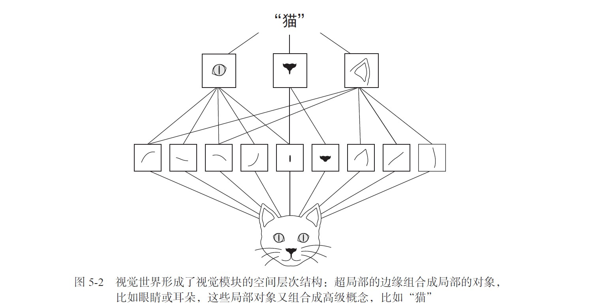

## 第五章 深度学习用于计算机视觉

### 5.0 概览

主要内容：

1. 理解卷积神经网络（convnet）  
2. 使用数据增强来降低过拟合  
3. 使用预训练的卷积神经网络进行特征提取  
4. 微调预训练的卷积神经网络  
5. 将卷积神经网络学到的内容及其如何做出分类决策可视化  

### 5.1 卷积神经网络简介

先实例化一个简单的卷积神经网络模型,并做出简单的说明  

```python
from keras import layers
from keras import models
model = models.Sequential()
model.add(layers.Conv2D(32, (3, 3), activation='relu', input_shape=(28, 28, 1)))
model.add(layers.MaxPooling2D((2, 2)))
model.add(layers.Conv2D(64, (3, 3), activation='relu'))
model.add(layers.MaxPooling2D((2, 2)))
model.add(layers.Conv2D(64, (3, 3), activation='relu'))
```

可以看到卷积神经网络是conv2D层和MaxPooling2D层的交替堆叠。  

卷积神经网络的接受形状是(image_height,image_width,image_channels),这是一个3D张量，从第二章可以知道图像一般存储与4D张量中，但是不管是深度神经网络还是卷积神经网络，我们接受的形状都只需要特征shape，那么自然这里也不包括样本维度（或批量维度）。**对于整个卷积神经网络的接受形状只需要在第一层传入input_shape=(image_height,image_width,image_channels)**即可，本例中即(28,28,1)。

列出卷积神经网络的架构

```python
>>> model.summary()
_________________________________________________________________
Layer (type) Output Shape 								Param #
=================================================================
conv2d_1 (Conv2D) (None, 26, 26, 32) 					320
_________________________________________________________________
max_pooling2d_1 (MaxPooling2D) (None, 13, 13, 32) 		0
_________________________________________________________________
conv2d_2 (Conv2D) (None, 11, 11, 64) 					18496
_________________________________________________________________
max_pooling2d_2 (MaxPooling2D) (None, 5, 5, 64) 		0
_________________________________________________________________
conv2d_3 (Conv2D) (None, 3, 3, 64) 						36928
=================================================================
Total params: 55,744
Trainable params: 55,744
Non-trainable params: 0
```

> 回忆一下神经网络，第一层输入的input_shape为(28,28).reshape(-1,1),即将所有特征列展平，然后作为这一层权重矩阵的行数，而列数就是这一层输出的神经元个数(new_features)，那么这一层输出矩阵就是  （samples,new_features),因为我们可以很清晰的知道矩阵运算，输入矩阵的一行（就是一个样本）乘以该层的权重矩阵的一列，所以得出权重矩阵的行数就应该是输入矩阵的列数（即输入了多少个特征）。  
>
> 但是在卷积神经网络里，我们无法想象每一层做的运算是怎么样的，也就很难计算该层该有多少个参数，以及输入、输出（不再是矩阵）代表着什么，又是多少？带着这个疑问继续向后看。

虽然暂时还无法理解，但是可以知道，我们可以设置输入的形状（上面提到），每一层的输出也可以设置

> 对于Conv2D层和MaxPooling2D层而言，**输出为(height,width,channels)**的一个3D张量。但是请注意，设定这些参数时**顺序不一样，他将通道数量放在第一个，而宽高作为元组放在第二个上，即(channels,(height,width)**,并且通道数量一般设置为32或64。这三个维度的意义待会再讲。

现在需要将输出张量输入到神经网络里(密集连接分类网络，就是第二章那个)，因为是接上面model添加的层，所以直接使用Flatten()就会将输入的特征张量展平为一层（不包括样本维度）  

```python
model.add(layers.Flatten())
model.add(layers.Dense(64, activation='relu'))
model.add(layers.Dense(10, activation='softmax'))
```

查看网络架构

```python
>>> model.summary()
_________________________________________________________________  
Layer (type) Output Shape 								Param #  
=================================================================   
conv2d_1 (Conv2D) (None, 26, 26, 32) 					320  
_________________________________________________________________
max_pooling2d_1 (MaxPooling2D) (None, 13, 13, 32) 		0  
_________________________________________________________________  
conv2d_2 (Conv2D) (None, 11, 11, 64) 					18496  
_________________________________________________________________  
max_pooling2d_2 (MaxPooling2D) (None, 5, 5, 64) 		0  
_________________________________________________________________  
conv2d_3 (Conv2D) (None, 3, 3, 64) 						36928  
_________________________________________________________________  
flatten_1 (Flatten) (None, 576) 						0  
_________________________________________________________________  
dense_1 (Dense) (None, 64) 								36928   
_________________________________________________________________  
dense_2 (Dense) (None, 10) 								650  
=================================================================  
Total params: 93,322
Trainable params: 93,322
Non-trainable params: 0
```

下面训练并测试，可以得出准确率非常高，为99.3%

```python
from keras.datasets import mnist
from keras.utils import to_categorical
(train_images, train_labels), (test_images, test_labels) = mnist.load_data()
train_images = train_images.reshape((60000, 28, 28, 1))
train_images = train_images.astype('float32') / 255
test_images = test_images.reshape((10000, 28, 28, 1))
test_images = test_images.astype('float32') / 255
train_labels = to_categorical(train_labels)
test_labels = to_categorical(test_labels)
model.compile(optimizer='rmsprop',
loss='categorical_crossentropy',
metrics=['accuracy'])
model.fit(train_images, train_labels, epochs=5, batch_size=64)
我们在测试数据上对模型进行评估。
>>> test_loss, test_acc = model.evaluate(test_images, test_labels)
>>> test_acc
0.99080000000000001
```

#### 5.1.1 卷积运算

卷积层和密集连接层的最大区别就是卷积层是局部模式学习，而密集连接层学习的是全局模型，全局模式就是输入的特征全部进行“观察”进行学习，我们之前就是每一层将输入都一次性纳入计算并输出给下一层；而局部模型是设定更小的窗口（比如我只学3*3这么大窗口的特征，每一层可以学很多个这样的小窗口），通过更加细致的学习然后再组成整个特征集，这样肯定学得更好。


基于此特点卷积神经网络具有一下两个重要性质：  

> - 卷积神经网络学到的模式具有平移不变性（translation invariant):在图像的某个部分学到的局部模式（也就是长什么样子），它可以在其他地方也找到这种模式。而密集连接网络是学得全局模式，比方说前者在某一图像上学到一个数字9，那么在很多其他图，都可以识别到9（有的话），而后者学的是一整张图，其他图也是这个模式（整张图）的概率显然小的多，这就是视觉世界的平移不变性。这意味这对于卷积神经网络而言更少的训练样本就可以学到更强泛化能力的数据表示。  
> - 卷积神经网络可以学到模式的空间层次结构(spatial hierarchies of patterns):简而言之就是将第一层学到的局部模式输入给第二层，第二层就会将这些局部模式特征组成更大更富杂的模式。这就叫做空间层次结构。(下图由下到上)



现在我们来解析上面提到的输入特征，即（image_height,image_width,image_channel),高和宽是是两个空间轴，定义了一个样本的图像空间特征，而通道轴（也叫深度轴）他并不是空间轴，而是表示一个图像上每个像素点的颜色特征，比如黑白图像就是灰度，深度轴维度就是1，而RGB图像是红绿蓝，则深度轴维度为3。所以这就解释了为什么我们输入的是一个3D张量，而得到是一个2D张量的图像。我们将这种3D张量的卷积叫做特征图(feature map)。（3D张量的卷积怎么算我们还没有概念，先记住这个词）  

接着再讲输出，卷积层将从输入特征图里提取图块，对所有小图块进行卷积运算，生成输出特征图(output feature map)。该图依然是一个3D张量，空间轴仍旧是宽和高，但是深度轴却是设定的任意值，他是该层的一个参数，也不再是输入特征图那样表示颜色或灰度，而是一种模式（或者称之为过滤器）。本来是红蓝绿的颜色特征，现在变成了一组其他特征，比如（有没有1，有没有2……）这样一组特征。不过需要注意的是，这个过滤器会对输入特征图上的所有区域都检测他是否有这个过滤器的模式。而不是只对一个像素区域起作用（这是我原来的想法，一个区域的颜色特征变成了过滤器的特征模式）。那么对于每一个通道，都会得到一个（height,width)的2D数值网格，它叫做该过滤器对输入的响应图，表示这个过滤器模式在输入的不同位置的相应。这也是特征图这一术语的含义：深度轴的每个维度都是一个特征（或过滤器），而2D 张量output[:, :, i] 是这个过滤器在输入上的响应
的二维空间图（map）。

> 回忆一下密集连接类型某一层输出多少个神经元，这个不是一个参数，这里为什么说深度轴的维度是该层的一个参数呢？


在上面的例子里，第一个卷积层接受（28，28，1）的输入特征图，输出（26，26，32）的输出特征图，先不管他尺寸为什么变小了，单看深度通道数变为32了，那么也就是说这32个过滤器的每一个里都有一张26*26的数值网格，其意义是对于整张输入特征图的所有提取块而言，他是否有某个过滤器模式。从上面的图可知，一个过滤器就可以粗略的识别出输入图像的特征。

卷积运算有两个很重要的参数：

1. 从输入特征图里提取的图块尺寸：一般为3x3或5x5.
2. 输出特征图的深度：卷积所计算的过滤器的数量。本例第一层为32，最后一层为64

> 其实到这里我们还是不清楚为什么深度通道是该层参数，因为参数是需要学习进行调整的，这种手动指定难道不是超参数？同时还有一个问题，这里只指定了数量，但却并不知道每一个模式究竟是什么。 