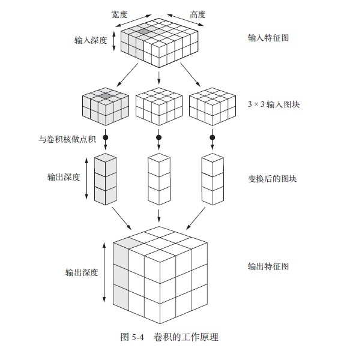

### 1 卷积神经网络补充

#### 1.1 卷积神经网络的卷积核计算过程

我们知道，卷积核对于提取窗口所做的是线性变换，那么这个线性变换具体是什么样的呢?  

在回答此问题之前，首先要明白我们的输入特征图和输出特征图。请看下图。  



对于最上面的是第一层的输入特征图(5x5x2)，我们叫他图的原因是只有长和宽是空间轴，而输入深度是深度轴，代表了通道数（2个，也即过滤器数，第一层往往不这么叫），再看最后的输出特征图(3x3x3),即3x3的图，通道数是3，通道数的意义之前解释过，即一种过滤模式。（举个例子，如果通道数为3代表的是RGB颜色，那么3个通道就相当于是三张图合并之后的结果，每一张图是一种单独的颜色，不同地方的深浅不一样，合并之后就是输入的图像）基于此图，给出该层的架构为     

```python
keras.layers.Conv2D(3,(3,3),input_shape=(5,5,2))
```

我们设定了提取窗口为3x3，并且没有设置填充padding，那么输出特征图的长和宽即为确定的1+(5-3)=3,即3x3个，而通道数为3，也就是输出深度为3。那么中间的计算过程如下：  

> 首先要知道卷积核长什么样，卷积核取决于两个参数，第一：输出特征图的通道，这个决定了卷积核的个数，第二：输入特征图的通道，这个决定了卷积核的通道数（等于输入特征图通道数）。为什么是这样的呢？  

因为每一个输出特征图的通道就是一个模式，他要的结果就是这个模式在输入特征图上的响应，那么这个模式就用卷积核来定义，所以输出特征图的一个通道对应了一个卷积核，卷积核是3x3的（只讨论空间轴，上图中没画出来只有一个点），所以提取图块也是3x3的。他们做运算后生成了一个图块（即上图变换后的图块的一个小块），位置是根据提取图块来的，而输出有三个通道，那么就有三个卷积核，所以这个位置就有三个块组成的一条。搞清楚这个之后，每一个通道的卷积核要和提取图块做运算，首先要保证，他们的三个轴都是一样的形状。所以每一个卷积核的通道数是等于每一个提取图块的通道数，是等于输入特征图的通道数的。通道数在图中的表现就是一层一层的。而每一层所做的运算就是卷积核和提取图块的对应位置相乘加起来，然后所有层弄出一个数（这里不知道怎么计算的），在考虑偏置量，这样每一个提取图块在该通道卷积核的作用下转换成了一个数。


这个图描述了一个卷积核在输入单通道上的计算过程。  

> 总结：输入特征图的单通道定义了一个卷积核，而每一个卷积核都是（通道数等于输入特征图通道数的）多通道的。这里的概念很容易混淆。

#### 1.2 卷积神经网络的参数计算

参数指的就是卷积核里面有多少个格子，因为一个格子就是一个参数，再加上每一个卷积核都有一个偏置量。那么基于1.1的分析，我们可以很容易的计算上面那个例子的参数个数。首先是输出特征图有3个通道，那么就有3个卷积核，每个卷积核是3x3x2的，那么就是3x(3x3x2)+3=54个参数。  

我们再看mnist的参数： 

```python
from keras import layers
from keras import models
model = models.Sequential()
model.add(layers.Conv2D(32, (3, 3), activation='relu', input_shape=(28, 28, 1)))
model.add(layers.MaxPooling2D((2, 2)))
model.add(layers.Conv2D(64, (3, 3), activation='relu'))
model.add(layers.MaxPooling2D((2, 2)))
model.add(layers.Conv2D(64, (3, 3), activation='relu'))
```

```python
>>> model.summary()
_________________________________________________________________
Layer (type) Output Shape 								Param #
=================================================================
conv2d_1 (Conv2D) (None, 26, 26, 32) 					320
_________________________________________________________________
max_pooling2d_1 (MaxPooling2D) (None, 13, 13, 32) 		0
_________________________________________________________________
conv2d_2 (Conv2D) (None, 11, 11, 64) 					18496
_________________________________________________________________
max_pooling2d_2 (MaxPooling2D) (None, 5, 5, 64) 		0
_________________________________________________________________
conv2d_3 (Conv2D) (None, 3, 3, 64) 						36928
=================================================================
Total params: 55,744
Trainable params: 55,744
Non-trainable params: 0
```

- 第一层：32x(3x3x1)+32=320

- 第二层(不考虑池化层）：64x(3x3x32)+64=18496

- 第三层(不考虑池化层)：64x(3x3x64)+64=36928

### 2 深度可分离卷积神经网络

#### 2.1 原理

回忆普通的卷积神经网络，他可以这样描述一层的转换：输出特征图现在定义了m个通道，我每一个通道都有一个卷积核来定义我想要的模式，我拿着我的模式去对输入特征图(n个通道）进行‘比对’，卷积核定义的模式是对输入特征图的所有通道一起计算的（即通道数一样，每个通道求完之后还要求和）。而每一个卷积核都要这样把输入特征图的所有通道比对，总共就有m次。（这样参数就会有m\*(3\*3\*n)个）。

而现在深度可分离的思想就是，我可不可以先把输入特征图的每个通道用都用一个模式来‘比对‘，即我保证输入特征图的长宽不变，通道数也不变，即我针对每一个通道，只用一个单通道的卷积核(3x3x1)来运算，这里就实现了第一次比对（比对之后相当于加快学习），这样做了后的得到的“中间特征图”（自己起的名），这时候我只需要使用一个很小的提取窗口（卷积核）就可以实现比较好的效果。（这时候参数就只有n\*(3x3x1)+m\*(1x1xn)个）

> 为什么？我的看法是卷积核或提取窗口越小提取的有用信息越少，但是第一次比对之后学到的了更大的模式，下一次就可以使用更下的窗口也能达到没有使用第一次比对的效果。举个例子，某一个提取窗口比如学的是猫的耳朵，输入特征图我可以这个分他的通道，加入有两个通道，第一个代表毛长，第二个代表颜色，第一次在每个通道比对过滤，可能是这样的模式，毛长小于1厘米，颜色为灰、白、或黑。那么第一次过滤之后，毛长大于1厘米的地方和颜色不是这三类的都被去除或淡化了，那么第二次就可以通过更小的窗口就可以识别出这就是猫耳朵，因为淡化了的地方很快就可以判别出不是。

#### 2.2 参数计算

还是拿5x5x2的输入特征图和3x3x3的输出特征图做例子。

参数为：

- 首先是第一段处理：2x(3x3x1)=18
- 然后是第二段处理：3x(1x1x2)+3=9

则一共27个参数。

再看mnist数据集 ：  

```python
model = keras.models.Sequential()
model.add(keras.layers.Conv2D(filters=32, kernel_size=3,
                              padding='same',
                              activation='selu',
                              input_shape=(28, 28, 1)))
#这里就是深度可分离卷积
model.add(keras.layers.SeparableConv2D(filters=32, kernel_size=3,
                                       padding='same',
                                       activation='selu'))
model.add(keras.layers.MaxPool2D(pool_size=2))
model.add(keras.layers.SeparableConv2D(filters=64, kernel_size=3,
                                       padding='same',
                                       activation='selu'))
model.add(keras.layers.SeparableConv2D(filters=64, kernel_size=3,
                                       padding='same',
                                       activation='selu'))
model.add(keras.layers.MaxPool2D(pool_size=2))
model.add(keras.layers.SeparableConv2D(filters=128, kernel_size=3,
                                       padding='same',
                                       activation='selu'))
model.add(keras.layers.SeparableConv2D(filters=128, kernel_size=3,
                                       padding='same',
                                       activation='selu'))
model.add(keras.layers.MaxPool2D(pool_size=2))
```

架构：

```python
>>> model.summary()
_________________________________________________________________
Layer (type)                 Output Shape              Param #   
=================================================================
conv2d (Conv2D)              (None, 28, 28, 32)        320       
_________________________________________________________________
separable_conv2d (SeparableC (None, 28, 28, 32)        1344      
_________________________________________________________________
max_pooling2d (MaxPooling2D) (None, 14, 14, 32)        0         
_________________________________________________________________
separable_conv2d_1 (Separabl (None, 14, 14, 64)        2400      
_________________________________________________________________
separable_conv2d_2 (Separabl (None, 14, 14, 64)        4736      
_________________________________________________________________
max_pooling2d_1 (MaxPooling2 (None, 7, 7, 64)          0         
_________________________________________________________________
separable_conv2d_3 (Separabl (None, 7, 7, 128)         8896      
_________________________________________________________________
separable_conv2d_4 (Separabl (None, 7, 7, 128)         17664     
_________________________________________________________________
max_pooling2d_2 (MaxPooling2 (None, 3, 3, 128)         0         
_________________________________________________________________
flatten (Flatten)            (None, 1152)              0         
_________________________________________________________________
dense (Dense)                (None, 128)               147584    
...
Total params: 184,234
Trainable params: 184,234
Non-trainable params: 0
_________________________________________________________________
```

1. 看第一个深度可分离卷积层：

   - 第一段：32x(3x3x1)=288

   - 第二段：32x(1x1x32)+32=1056

​		总共1344个参数

2. 看第二个深度可分离卷积层：

   - 第一段：32x(3x3x1)=288
   - 第二段：64x(1x1x32)+64=2112

   总共2400个参数

后面的同理，不再赘述。


